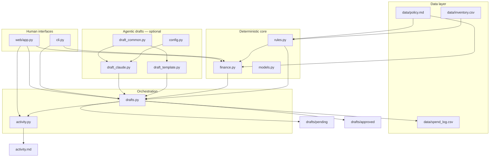

# Architecture

## Executive overview

The agent has **three runtime concerns** separated on purpose:

1. **Deterministic** — inventory rules, policy parsing, finance math (no LLM)
2. **Agentic** — optional Claude draft emails (template fallback always works)
3. **Human gate** — approve before anything leaves the system; no SMTP



## Module dependency graph

Dependencies flow **inward** — `models` and `paths` have no business logic; `rules` and `finance` never import drafts; drafts imports finance + rules but not CLI/web.

```
paths.py          (constants only)
models.py         → paths
config.py         → paths
rules.py          → models, paths
finance.py        → models, paths, rules
draft_common.py   → finance, rules
draft_template.py → draft_common, finance, models, rules
draft_claude.py   → config, draft_common, draft_template, finance, models, rules
drafts.py         → activity, draft_claude, finance, models, paths, rules
activity.py       → paths
cli.py            → config, drafts, finance, paths, rules
web/app.py        → supplier_agent.* (thin HTTP shell)
```

**Rule:** CLI and web are **thin shells**. All business logic lives in `supplier_agent/` so pytest can cover it without HTTP.

## Request lifecycle (happy path)

| Step | Module | Function | Output |
| --- | --- | --- | --- |
| 1 | `rules` | `load_inventory()` | `list[Item]` |
| 2 | `rules` | `check_items()` | SKUs where `on_hand <= reorder_point` |
| 3 | `finance` | `analyze_item(item)` | `SkuFinance` — days to stockout, expedite risk, run-blocked |
| 4 | `drafts` | `create_drafts(low)` | One `.md` per SKU per day in `drafts/pending/` |
| 5 | `draft_claude` | `generate_draft()` | Template **unless** `DRAFT_MODE=claude` + API key |
| 6 | `activity` | `log_activity("draft PO", …)` | Row in `activity.md` |
| 7 | Human | CLI `approve` or web Approve button | — |
| 8 | `drafts` | `approve_draft(id)` | Move to `approved/`, update status text |
| 9 | `finance` | `record_approval(item, po_ref)` | Row in `spend_log.csv` |
| 10 | `activity` | `log_activity("approve PO", …)` | Audit row |

## Draft deduplication

Draft IDs: `{sku}_{YYYYMMDD}` (e.g. `A1435101_20260610`).

`create_drafts()` skips SKUs that already have a pending file for **today**. Prevents duplicate emails on repeated `run` clicks.

## Finance integration points

Finance is not a separate pipeline — it **enriches** every draft and approval:

- **Draft header** — planned cost, expedite exposure, reorder-by date, run-blocked flag
- **Template body** — asks supplier for standard delivery when at risk
- **Claude user payload** — full finance context in `draft_claude._user_payload()`
- **ROI headline** — `finance_summary()` for CLI `finance` and web Finance tab
- **Spend log** — `record_approval()` on approve (standard shipping; optional `--expedite`)

Expedite surcharge model (from policy):

```
surcharge = max(flat_chf, planned_cost × percent / 100)
```

## Dual draft modes

| Mode | Config | Behaviour |
| --- | --- | --- |
| **Template** (default) | `DRAFT_MODE=template` or unset | No network; deterministic email from `draft_template.py` |
| **Claude** | `DRAFT_MODE=claude` + `ANTHROPIC_API_KEY` | Anthropic API; falls back to template on error |

See [OPERATIONS.md](OPERATIONS.md) and repo-root `DRAFT_MODES.md`.

## Safety and guardrails

| Guardrail | Implementation |
| --- | --- |
| No auto-send | No SMTP, SendGrid, or mailto automation anywhere |
| Human approve | `approve_draft()` required before `approved/` |
| Audit trail | Every draft, approve, run, reset → `activity.md` |
| Demo reliability | Template default; Claude opt-in only |
| Fail-soft agent | Claude errors → template draft, demo never breaks |

## Extension points (future v3)

- Group drafts by supplier (one email, multiple line items)
- Ingest stock from LIMS / barcode CSV export
- Slack notification when draft pending > 24h
- Scheduled `cli run` via launchd or GitHub Actions
- Read `benchling_export_sample.csv` for run-date hints (L8 stub)

## Testing strategy

Each layer has targeted pytest:

| Test file | Covers |
| --- | --- |
| `test_rules.py` | CSV load, overrides, low-stock count |
| `test_finance.py` | Expedite math, run-blocked hero SKU, spend log append |
| `test_drafts.py` | Create, dedup, approve, template default |
| `test_config.py` | Draft mode resolution |
| `test_activity.py` | Log read/write |

Run: `python -m pytest tests/ -v`

## Related docs

- [PROJECT_STRUCTURE.md](PROJECT_STRUCTURE.md) — file-by-file reference
- [LAYERS.md](LAYERS.md) — how we built bottom-up
- [DATA_MODEL.md](DATA_MODEL.md) — schemas
