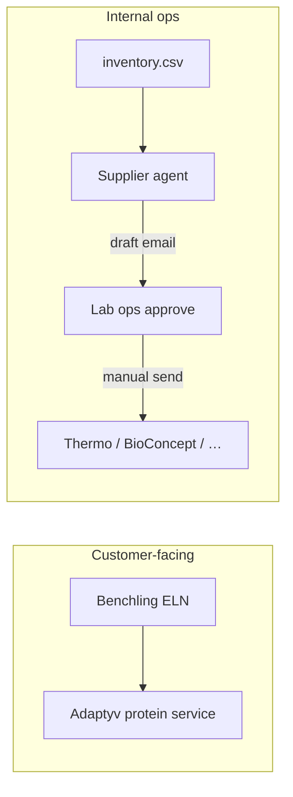

# Benchling positioning

How this project fits next to Benchling at Adaptyv — **not a replacement**.

## Two different workflows

| | **Benchling** | **This agent** |
| --- | --- | --- |
| **Who** | External customers | Internal lab ops |
| **What** | Order protein expression **service** from Adaptyv | Reorder **consumables** from suppliers |
| **Interface** | ELN → service catalog → Adaptyv fulfils | Inventory rules → draft PO email → human sends |
| **Data** | Sequences, experiments, service requests | CSV inventory, supplier emails, CHF costs |
| **Payment story** | Customer invoicing | Internal expedite avoidance, spend log |

## Narrative for interview

> "Benchling is how customers place assay orders from their ELN. This agent is internal ops — when we're down to two boxes of Expi293 and have a run Tuesday, we need a draft supplier email, expedite exposure in CHF, and a human approve before anything goes out. Different user, different guardrails."

## Complementary, not competitive

## Planned L8 artifact

`data/benchling_export_sample.csv` — stub export showing **customer assay orders** (e.g. protein ID, scale, due date). Used only to contrast:

- Benchling row = revenue / service delivery
- Inventory row = cost / consumable depletion

_No live Benchling integration in v2._ Extension point if Adaptyv wants run-date hints fed from ELN into `next_run_date`.

## Questions you may get

**"Why not build this inside Benchling?"**  
Benchling is customer ELN + service ordering. Internal supplier PO workflow needs different data (supplier emails, CHF expedite, local policy) and must work when ops lives in spreadsheets.

**"Could they integrate later?"**  
Yes — read run schedule from ELN export → populate `next_run_date` → improve `run_blocked` signal. Agent stays the approve + audit layer.

---

## Related docs

- [SUMMARY.md](SUMMARY.md) — final one-liner (L9)
- [INTERVIEW_QA.md](INTERVIEW_QA.md) — more Q&A (L8)
